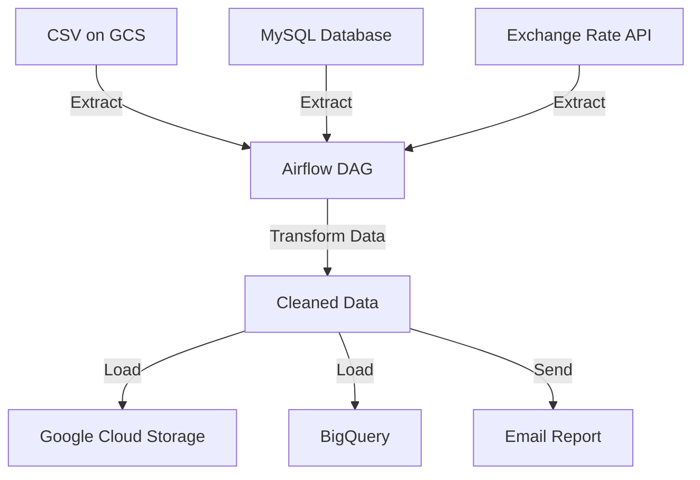

# **Project On-Cloud (GCP) Sales Pipeline**

## **วัตถุประสงค์**
1. **Extract**
   - ดึงข้อมูล CSV ยอดขายจาก Google Cloud Storage  
   - ดึงข้อมูลสินค้าและลูกค้าจาก Google Cloud SQL  
   - ดึงข้อมูลอัตราแลกเปลี่ยน USD → THB จาก API  
2. **Transform**
   - แปลงข้อมูลที่ได้จากขั้นตอน Extract  
   - ทำความสะอาดข้อมูล (Data Cleaning)  
   - รวมข้อมูลเป็นตารางเดียวกัน  
3. **Load**
   - บันทึกไฟล์ที่ประมวลผลแล้วขึ้น GCS  
   - โหลดเข้าสู่ BigQuery เพื่อวิเคราะห์ต่อ  
4. **Deliver**
   - ส่งไฟล์รายงานผ่านอีเมล

---

## ☁️ **Data Sources**
- **Google Cloud Storage (GCS)**  
  - เก็บไฟล์ CSV ยอดขาย (Raw Data)  
  - เก็บไฟล์ที่ประมวลผลแล้ว (Cleaned Data)

- **Cloud SQL (MySQL)**  
  - ตาราง `customers` : ข้อมูลลูกค้า  
  - ตาราง `products` : ข้อมูลสินค้า  
  - ตาราง `sales` : ข้อมูลการขาย

---
    
## **Workflow Diagram**

---

## **Tech Stack**
1. Python 3
2. Apache Airflow (Cloud Composer)
3. Google Cloud Storage (GCS)
4. BigQuery
5. MySQL
6. Pandas
7. Requests (API Integration)

---

**Project Structure**
project_oncloud_sales_pipeline/
|
|— dags/
|  |— etl_pipeline_dag.py
|  |— scripts/
|     |— __init__.py
|     |— extract_csv.py
|     |— extract_mysql.py
|     |— fetch_exchange_rate.py
|     |— load_to_bigquery.py
|     |— log_start_log_end.py
|     |— main.py
|     |— parse_datetime.py
|     |— send_email_report.py
|     |— transform_final_report.py
|     |— transform_mysql_data.py
|     |— upload_raw_csv_to_gcs.py
|     |— upload_to_gcs.py
|  |— output
|
|
|— .gitignore
